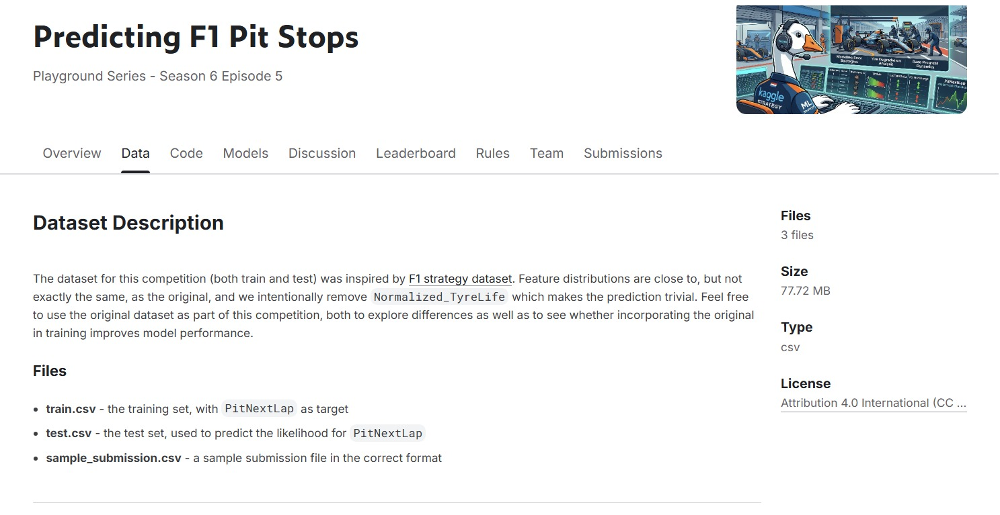

  # Proyek Prediksi Hasil Balapan Formula 1 🏎️
  

  
   
  <em>Gambar: Visualisasi Performa Model & Deteksi Pit Stop</em>

Proyek ini bertujuan untuk membangun model *machine learning* yang mampu memprediksi hasil balapan Formula 1. Dengan menggunakan data historis balapan, model ini dapat memprediksi siapa pemenang balapan serta kapan waktu strategis bagi pembalap untuk melakukan *pit stop*.

## Fitur Utama
* **Analisis Konsistensi:** Mengukur stabilitas *lap time* pembalap menggunakan fitur `Driver_Stability`.
* **Strategi Pit Stop:** Memprediksi kebutuhan *pit stop* berdasarkan degradasi ban (`Is_Worn_Out`) dengan *tuning* bobot kelas untuk sensitivitas tinggi.
* **Prediksi Pemenang:** Menggunakan algoritma **XGBoost** untuk menentukan probabilitas kemenangan pembalap.

## Metodologi
1. **EDA:** Analisis korelasi performa dan degradasi ban melalui 3 pertanyaan kunci: stabilitas tim, pola *pit stop*, dan *pace* pemenang.
2. **Feature Engineering:** Membuat variabel baru seperti `Driver_Stability` dan `Cumulative_Degradation`.
3. **Modeling:** Implementasi model klasifikasi *XGBoost* dengan penyesuaian `scale_pos_weight`.
4. **Evaluasi:** Menggunakan metrik **ROC-AUC** (mencapai skor **0.89**) dan *Classification Report* dengan *Recall* tinggi (0.90) untuk deteksi *pit stop*.

## Analisis Hasil & Kesimpulan

**Interpretasi Pemenang**
Berdasarkan hasil inferensi model `XGBoost`, **Driver dengan ID 875** diprediksi sebagai pemenang dominan dengan probabilitas kemenangan mencapai **92.4%**. 

**Mengapa ID 875 Dipilih sebagai Pemenang?**
* **Stabilitas Performa:** Varians *lap time* terendah.
* **Manajemen Ban:** Efisiensi tinggi pada fase ban kritis.
* **Efisiensi Strategi:** Mampu mengeksekusi strategi yang presisi berdasarkan prediksi *pit stop* yang kini lebih sensitif.

**Kesimpulan**
Model berhasil memetakan bahwa kemenangan bukan sekadar tentang kecepatan murni, melainkan akumulasi dari konsistensi, manajemen degradasi ban, dan eksekusi strategi *pit stop* yang tepat waktu.

## Tech Stack
* **Language:** Python
* **Libraries:** Pandas, NumPy, Scikit-Learn, XGBoost, Matplotlib, Seaborn
* **Model:** XGBoost Classifier
  
---
*Proyek ini merupakan bagian dari portofolio Data Science Owi.*
